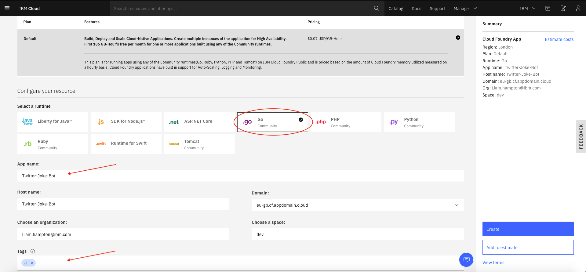

# Hosted Golang Twitter Bot

This workshop will show you how to build a simple Golang application and then deploy it to your preferred cloud environment

## Golang Installation

### Automated Installation (Ubuntu 16.04+ & macOS only)

Use [this open source repository](https://github.com/canha/golang-tools-install-script) to install Golang onto your machine.

Ubuntu 16.04+
```bash
wget -q -O - https://raw.githubusercontent.com/canha/golang-tools-install-script/master/goinstall.sh \
| bash -s -- --version 1.14.1
```
macOS
```bash
curl https://raw.githubusercontent.com/canha/golang-tools-install-script/master/goinstall.sh \
| bash -s -- --version 1.14.1
```
or
```bash
brew install go
```

Once the installation has finished, create a folder called `github.com` inside `$HOME/go/src`. Copy and paste the following command to do this for you.
```bash
mkdir $HOME/go/src/github.com
```

### Manual Installation

1. To manually install the Go tools, use the [Go documentation](https://golang.org/doc/install) and follow the instructions 
2. Ensure your system follows the folder tree below

```bash
.
├── $HOME
│   ├── /go
|        ├── /bin
|        ├── /pkg
│        └── /src
|             └── /github.com
```

## Prerequisites

1. Twitter API Keys - These can be obtained by registering for a [developer account](https://developer.twitter.com/en/docs/basics/developer-portal/overview) on Twitter. This is only needed for the final lab and takes ~15minutes to set up
2. An IDE installed (GoLand/Visual Studio Code etc)

## Lab 0 - Install the Prerequisites

### IBM cloud command line interface

(If you already have these setup and installed, go straight to [Lab 1](../Lab1/README.md)) // FIX THIS LINK

1. Install the [IBM Cloud command-line interface from this link](https://cloud.ibm.com/docs/cli?topic=cloud-cli-install-ibmcloud-cli).     
Once installed, you can access IBM Cloud from your command-line with the prefix `ibmcloud`.
2. Log in to the IBM Cloud CLI: `ibmcloud login`.
3. Enter your IBM Cloud credentials when prompted.

   **Note:** If you have a federated ID, use `ibmcloud login --sso` to log in to the IBM Cloud CLI. Enter your user name, and use the provided URL in your CLI output to retrieve your one-time passcode. You know you have a federated ID when the login fails without the `--sso` and succeeds with the `--sso` option.

Once you are all set up you can move straight on to [Lab 1](../Lab1/README.md) // FIX THIS LINK

## Lab 1 - Creating a basic Golang Application :books:

### Step 1
// FIX THIS LINK

Clone [this]() repository into `$HOME/<user>/go/github.com` and then open the `<PROJECT NAME HERE>` directory into your preferred editor. (I use Visual Studio Code with the recommended [Go extension](https://code.visualstudio.com/docs/languages/go) installed from the marketplace)

### Step 2

First you need to make sure you can run the `main.go` file (located in `<PROJECTNAME>/cmd`). To do this, navigate to the directory in a new terminal window and use the command `go run cmd/main.go`. This will compile the code and run the program without building a binary (more on this later). The output should be `Hello Fellow Gopher!`.

Now the code is running successfully, you can see everything has been set up correctly and you are able to run Go code on your machine.

In the next lab we will turn this up a notch and turn our simple `hello world` program into a web server.

## Lab 2 - Lets get RESTful :dancer:

In this lab you are going to create a web app with some routes. To do this you will use the 3rd party import `gorilla/mux`. Some bedtime reading about this can be found [here](https://github.com/gorilla/mux). We will then follow this up to output a random joke by calling an open API without the need for authentication. The API in this lab is a dad joke API but feel free to explore and chose another if you'd like, the principals are the same!

### Step 1

First you will need to add a handler function to accept a router request to display a page. To do this, use the small code snippet below. Edit the code to include your name or a sentence and place it into the `main()` function.

```golang
func handler(w http.ResponseWriter, r *http.Request) {
    name := "<your name here>"
    logr.Info("Received request for the home page")
    w.Write([]byte(fmt.Sprintf("Hello, %s\n", name)))
}
```

> **Note**: You will also need to add the follow import to your code (this makes the terminal logs look pretty) :smile:

```golang
logr "github.com/sirupsen/logrus"
```

### Step 2

Now you have got a route handler, you need to create the web server to invoke it. To do this, use the code snippet below and insert it into your `main()` function. Instead of using the standard go `net/http` library's we will use a more powerful 3rd party import, `gorilla mux`.

```golang
// Create Server and Route Handlers
    r := mux.NewRouter()
    r.HandleFunc("/", handler)

    http.Handle("/", r)
    logr.Info("Starting up on 8080")
    logr.Error(http.ListenAndServe(":8080", nil))
```

> **Note**: If your plugin didnt already add the gorilla mux import, add the following line of code to your imports

```golang
"github.com/gorilla/mux"
```

This code will start up a server on port 8080.

### Step 3

Head back to your terminal window and run your code using the command `go run cmd/main.go`.
> **Note** You may be prompted by your system to allow a network connection (you need to allow this otherwise the application may not run correctly)

Open up a browser and type `localhost:8080` into the top URL bar and you should see the output from the `handler()` function on your screen.

### Step 4

The server is up and running but this is very basic. Type `control+c` in your terminal to terminate the server connection. Next, you will now add in a route to call an API without any authentication. In this workshop, it just calls a random joke generator but you can change this API to be whatever you'd like.

Firstly, you will need to write the code that invokes the API to get the data. The code snippet below is a new function.

```golang
func getJoke() (string, error) {
    logr.Infof("Getting joke from API..")
    req, err := http.NewRequest("GET", "https://icanhazdadjoke.com/", nil)
    if err != nil {
        return "", err
    }
    req.Header.Set("Accept", "text/plain")

    resp, err := http.DefaultClient.Do(req)
    if err != nil {
        return "", err
    }
    defer resp.Body.Close()

    body, err := ioutil.ReadAll(resp.Body)
    if err != nil {
        return "", err
    }

    return string(body), nil
}
```

This will return a string of the body and nil, since there is no error at this point. You can change the output type by changing the header in the request but we want to see the joke in plain text on the page.

Now the API call is in place, the next thing you need to do is add the handler, just like you did in Step 1.

To do this, add the new function shown below and then invoke it in the `main()` function, just like you did with the previous handler.

```golang
func jokeHandler(w http.ResponseWriter, r *http.Request) {
    w.WriteHeader(http.StatusOK)
    logr.Infof("Received request to show a joke")
    dadJoke, err := getJoke()
    if err != nil {
        logr.Error(err)
    }
    w.Write([]byte(fmt.Sprintf(dadJoke)))
    logr.Info(dadJoke)
}
```

```golang
r.HandleFunc("/showjoke", jokeHandler)
```

If you run the code and navigate to `localhost:8080/showjoke` in your browser you should now be presented with a randomly generated joke!

Now the jokes are flowing, lets get it up in the cloud. Continue to [Lab 3](../Lab3/README.md) to see how this is done 

## Lab 3 - Up in the :cloud:

Here you will have 2 options when deploying your application into a cloud environment. Choose your preferred method, or do both?

Before you can complete any of the next steps, you must either [sign up](https://cloud.ibm.com/registration) for an IBM Cloud account or [login](https://cloud.ibm.com/login) to your existing one

### Option 1 - IBM Cloud Foundary

### Step 1

- Install the [ibmcloud cli tool](https://cloud.ibm.com/docs/cli?topic=cloud-cli-install-ibmcloud-cli#shell_install) with the following commands. With this you can access IBM Cloud from your command-line with the prefix ibmcloud

**Mac**
```bash
curl -fsSL https://clis.cloud.ibm.com/install/osx | sh
```

**Linux**
```bash
curl -fsSL https://clis.cloud.ibm.com/install/linux | sh
```

**Windows Powershell**
```bash
iex(New-Object Net.WebClient).DownloadString('https://clis.cloud.ibm.com/install/powershell')
```
> **Note**: If you encounter errors like The underlying connection was closed: An unexpected error occurred on a send, make sure you have .Net Framework 4.5 or later installed. Also try to enable TLS 1.2 protocol by running the following command:

```bash
[Net.ServicePointManager]::SecurityProtocol = [Net.SecurityProtocolType]::Tls12
```

- Install the [Cloud Foundary cli tool](https://docs.cloudfoundry.org/cf-cli/install-go-cli.html#pkg). This will allow you to push your app to Cloud Foundary

You now need to prepare your application for Cloud Foundary. To do this, in the top level directory of your project create a file called `manifest.yml`. This will be the building blocks for your application when pushing it up to the cloud. Inside this add the following code

```yaml
---
applications:
- name: <name of your app as it appears in IBM Cloud>
  random-route: true
  memory: 128M
  env:
    GO_INSTALL_PACKAGE_SPEC: <name of the path to your main.go file on your system>
```

> **Note**: You will need to revisit this file later to amend some of the details - keep it open

### Step 2

The following screenshots illustrate how to set up a Cloud Foundary application in IBM Cloud. Follow these simple steps to get a resource up and running.

Login to IBM Cloud (or create an account if you still havent done so)


Navigate to the handburger menu on the left hand side and select "Cloud Foundary"


Create a public application


**IMPORTANT PART**: First, Make sure the Go runtime is selected and then fill in the detail boxes shown below, indicated with a red arrow. The rest will auto-fill as you type or already be populated with text. The hostname and domain can be left with the defaults already populated.



> **Note** Do not be alarmed at the pricing plan, you will not be exceeding the free allowance with this workshop. "First 186 GB-Hour's free per month for one or more applications built using any of the Community runtimes."

Once all the fields are completed, click create


> **Note**: The app could take a minute or two to start up so be patient :wink:

### Step 3

Revisit the `manifest.yml` file created in Step 1 and update the details. For example, it should look something like the following:

```yaml
---
applications:
- name: Twitter-Joke-Bot
  random-route: true
  memory: 128M
  env:
    GO_INSTALL_PACKAGE_SPEC: github.com/twitter-bot/cmd
```

### Step 4

In a terminal window, from within your project directory (`$HOME/go/src/github.com/<projectname>`), login to your IBM Cloud account. To do this:

1. Make sure you are logged into to the IBM Cloud via the CLI: `ibmcloud login`

> **Note:** If you have a federated ID, use `ibmcloud login --sso` to log in to the IBM Cloud CLI. Enter your user name, and use the provided URL in your CLI output to retrieve your one-time passcode. You know you have a federated ID when the login fails without the --sso and succeeds with the --sso option.


2. Enter your IBM Cloud credentials when prompted
3. Target Cloud Foundary with IBM Cloud by using: `ibmcloud target --cf`
4. Push your app into Cloud Foundary: `ibmcloud cf push`

Your application should be created and you should see it running in the UI :clap:

To see your application running and have it output a joke, go to the main resource page and click on the `Visit App URL`. At the end of the URL append `/showjoke`


### Option 2 - Kubernetes in IBM cloud

## Lab 4 - Tweet Tweet! :bird:

In this lab, we will look at transforming application into a twitter bot. To complete this, you must have a twitter developer account set up with the API keys to hand.