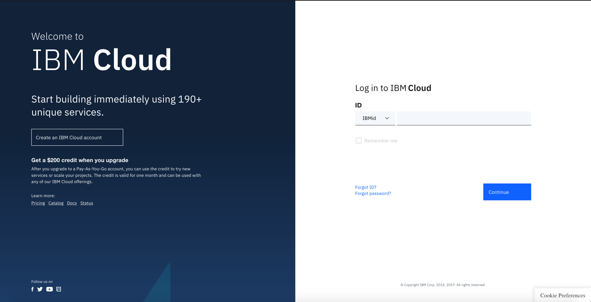
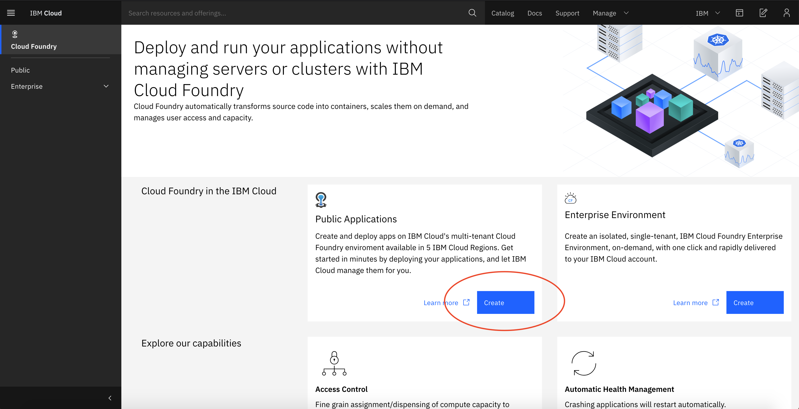

# Lab 3 - Up in the :cloud:

Here you will deploy your application into a cloud environment. Because it is straight forward in this Lab we will use IBM Cloud Foundary.

Before you can complete any of the next steps, you must either [sign up](https://cloud.ibm.com/registration) for an IBM Cloud account or make sure you are [logged into](https://cloud.ibm.com/login) to your existing one.

## IBM Cloud Foundary deployment

### Step 1

Install the [ibmcloud cli tool](https://cloud.ibm.com/docs/cli?topic=cloud-cli-install-ibmcloud-cli#shell_install) with the following commands. With this you can access IBM Cloud from your command-line with the prefix ibmcloud

Mac

```bash
curl -fsSL https://clis.cloud.ibm.com/install/osx | sh
```

Linux

```bash
curl -fsSL https://clis.cloud.ibm.com/install/linux | sh
```

Windows Powershell

```bash
iex(New-Object Net.WebClient).DownloadString('https://clis.cloud.ibm.com/install/powershell')
```


Note: If you encounter errors like The underlying connection was closed: An unexpected error occurred on a send, make sure you have .Net Framework 4.5 or later installed. Also try to enable TLS 1.2 protocol by running the following command:


```bash
[Net.ServicePointManager]::SecurityProtocol = [Net.SecurityProtocolType]::Tls12
```

## Step 2

The following screenshots illustrate how to set up a Cloud Foundary application in IBM Cloud. Follow these simple steps to get a resource up and running.

Login to IBM Cloud \(or create an account if you still havent done so\)



Navigate to the hamburger menu on the left hand side and select "Cloud Foundary"


Create a public application




IMPORTANT PART: First, Make sure the Go runtime is selected and then fill in the detail boxes shown below, indicated with a red arrow. The rest will auto-fill as you type or already be populated with text. The hostname and domain can be left with the defaults already populated.




Do not be alarmed at the pricing plan, you will not be exceeding the free allowance with this workshop. "First 186 GB-Hour's free per month for one or more applications built using any of the Community runtimes."


Once all the fields are completed, click create



Note: The app could take a minute or two to start up so be patient :wink:


## Step 3

You now need to prepare your application for Cloud Foundary. To do this, in the top level directory of your project create a file called `manifest.yml`. This will be the building blocks for your application when pushing it up to the cloud. Inside this add the following code. **Be sure to change the commented code!**

```yaml
---
applications:
- name: <name of your app as it appears in IBM Cloud> e.g Twitter-Joke-Bot
  random-route: true
  memory: 128M
  env:
    GO_INSTALL_PACKAGE_SPEC: <name of the path to your main.go file on your system> e.g github.com/twitter-bot/cmd
```

## Step 4

In a terminal window, from within your project directory \(`$HOME/go/src/github.com/<projectname>`\), you are going to login to your IBM Cloud account, target Cloud Foundary and then push your application up. To do this, follow the simple steps that follow:

1. Make sure you are logged into to the IBM Cloud via the CLI: `ibmcloud login`


Note: If you have a federated ID, use `ibmcloud login --sso` to log in to the IBM Cloud CLI. Enter your user name, and use the provided URL in your CLI output to retrieve your one-time passcode. You know you have a federated ID when the login fails without the --sso and succeeds with the --sso option.


1. Enter your IBM Cloud credentials when prompted
2. Target Cloud Foundary with IBM Cloud by using: `ibmcloud target --cf`
3. Push your app into Cloud Foundary: `ibmcloud cf push`

If the push is successful, your application will be created and you should see it running in the UI after a minute or two :clap:

To see your application running and have it output a joke, go to the main resource page and click on the `Visit App URL`. At the end of the URL append `/showjoke`

